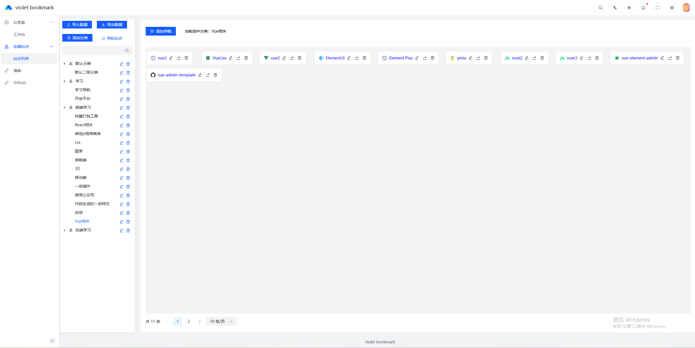
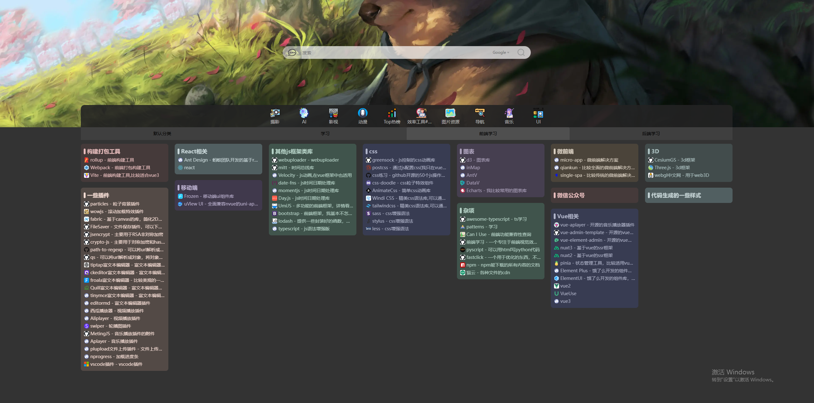

# 项目说明

- violet-bookmark 一款借鉴兰客书签的个人导航书签系统，支持手动添加或 url 自动解析添加书签的功能，方便对于一些常用书签的归纳整理。
- 演示环境：[http://bookmark.carolin-violet.cn:8000/](http://bookmark.carolin-violet.cn:8000/)
- 账户 user 12345678
- 后端接口直接连的我的线上环境，启动项目可以直接访问

# 技术栈

Aroc Design Pro、Vue3、Pinia、Typescript、Less、Echarts、Animat.css。

# 运行环境

node >= 18.20.5

# 项目启动

- 先运行 git clone https://github.com/carolin-violet/violet-bookmark-frontend.git 命令拉取前端代码
- 进入项目根目录运行 pnpm install 命令安装依赖
- 运行 npm run dev 命令启动

# 运行展示

- 页面
  
  
  

# 待办事项

- [ ] 导航站点图标目前是用谷歌 api 解析的（需使用梯子访问才能看到站点图标），最好能自动解析并保存起来
- [ ] 添加前端埋点 (一些点击次数,导航点击次数统计)
- [ ] 添加图表分析统计（拥有分类数目包含大分类小分类，各自分类拥有导航站点数，总共收纳分类数和导航站点数目，点击打开数量排行）
- [ ] 美化页面
